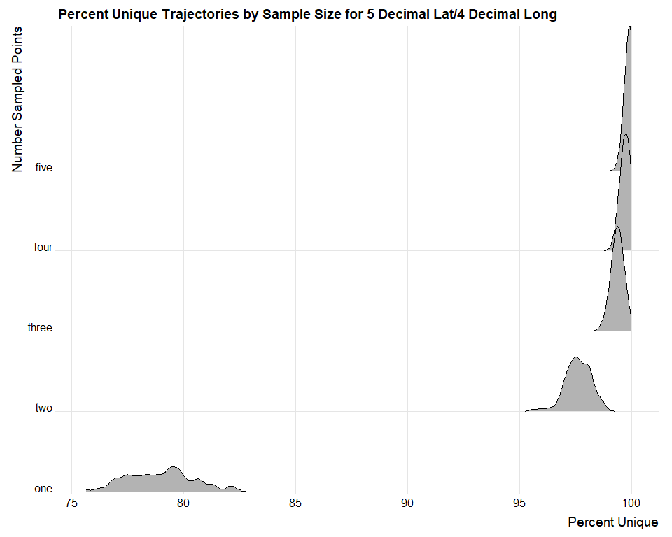
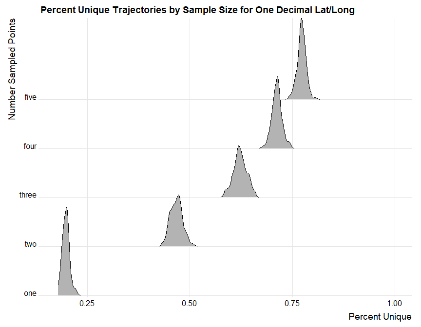
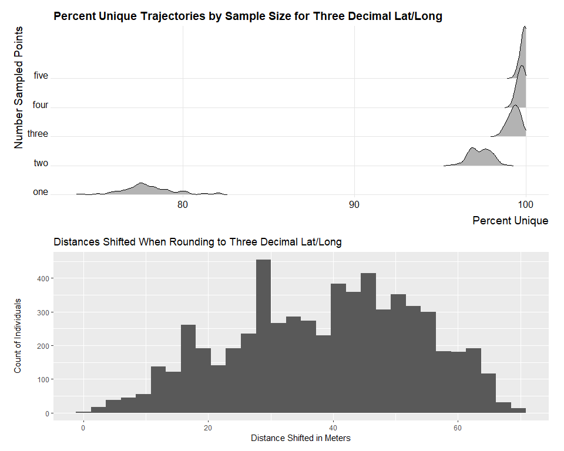
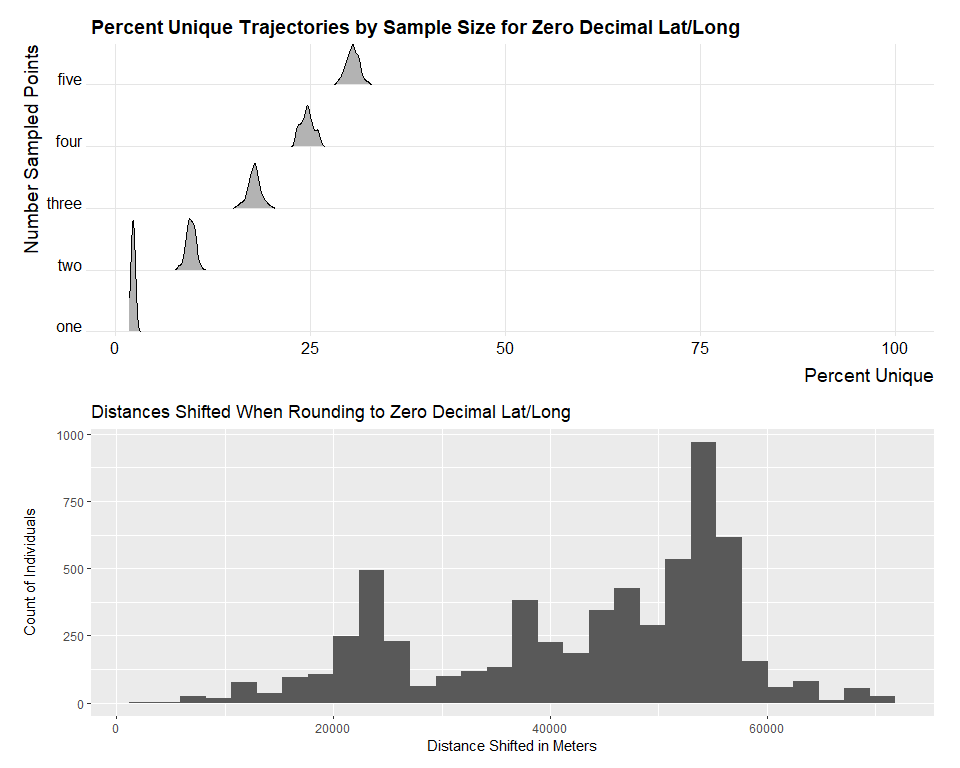
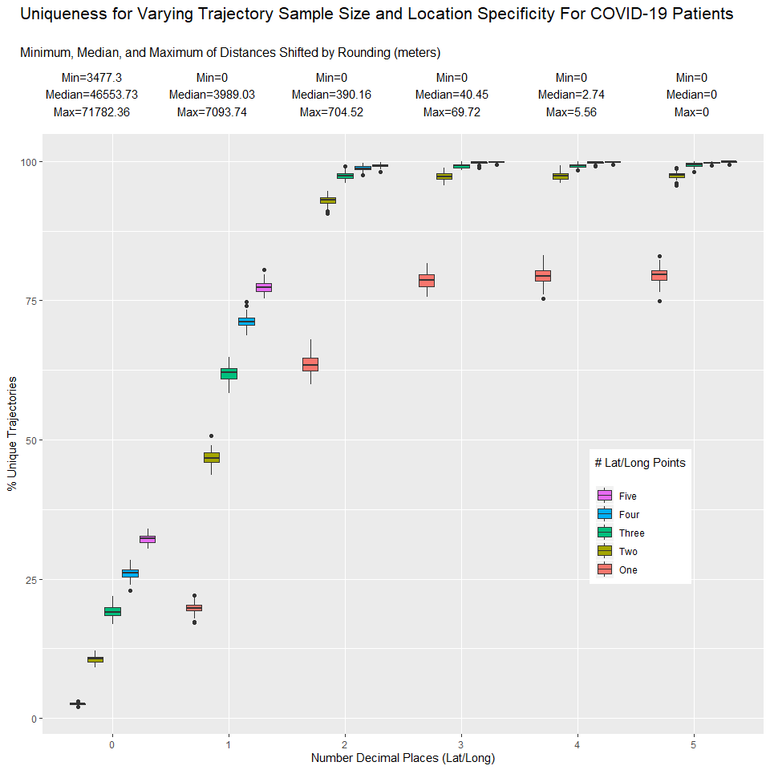

South Korea COVID-19 Patient Trajectory Analysis
================

<br>

## Overview

This project utilizes data on COVID-19 patient locations in South Korea.
We thank those who have worked to provide the **DS4C: Data Science for
COVID-19 in South Korea**
[kaggle](https://www.kaggle.com/kimjihoo/coronavirusdataset) and
[Github](https://github.com/ThisIsIsaac/Data-Science-for-COVID-19)
pages.

The data we use comes from the previously mentioned
[kaggle](https://www.kaggle.com/kimjihoo/coronavirusdataset) webpage.
See data description
[here.](https://www.kaggle.com/kimjihoo/ds4c-what-is-this-dataset-detailed-description)

-----

## Analysis

First, install and load necessary packages. We use the `tidyverse`
package for data manipulation and visualization, the `ggridges` package
for plotting densities for easy comparison, and the `patchwork` and
`gridextra` packages for displaying multiple plots together.

``` r
#install.packages('tidyverse')
#install.packages('patchwork')
#install.packages('gridExtra')
library(tidyverse)
library(patchwork)
library(ggridges)
library(gridExtra)
```

<br>

The data file `korea_covid_clean.RData` was created using the
`korea_data_cleaning.R` script which can be found in the repository
[here](https://github.com/cdbale/Hackathon/blob/master/Code/korea_data_cleaning.R).

<br>

First, we load the patient information and routes data. It consists of
COVID-19 patient epidemiological information as well as their locations
over time, measured in `latitude` and `longitude`. We define all of a
given individual’s observed locations as their location
**trajectory**.  
In terms of privacy, an individual’s location trajectory may reveal
sensitive information such as home address, work address, or other
frequently visited locations. A home address could then be linked to
other data such as public tax and real estate sale records.

``` r
load(file = "../Data/korea_data_clean.RData")
head(full)
```

    ## # A tibble: 6 x 22
    ##   patient_id global_num date       province city  type  latitude longitude sex  
    ##   <chr>           <dbl> <date>     <chr>    <chr> <chr>    <dbl>     <dbl> <chr>
    ## 1 1000000001          2 2020-01-22 Gyeongg~ Gimp~ airp~     37.6      127. <NA> 
    ## 2 1000000001          2 2020-01-24 Seoul    Jung~ hosp~     37.6      127. <NA> 
    ## 3 1000000002          5 2020-01-25 Seoul    Seon~ etc       37.6      127. <NA> 
    ## 4 1000000002          5 2020-01-26 Seoul    Seon~ store     37.6      127. <NA> 
    ## 5 1000000002          5 2020-01-26 Seoul    Seon~ publ~     37.6      127. <NA> 
    ## 6 1000000002          5 2020-01-26 Seoul    Seon~ publ~     37.6      127. <NA> 
    ## # ... with 13 more variables: birth_year <dbl>, age <chr>, country <chr>,
    ## #   disease <lgl>, infection_case <chr>, infection_order <dbl>,
    ## #   infected_by <chr>, contact_number <dbl>, symptom_onset_date <date>,
    ## #   confirmed_date <date>, released_date <date>, deceased_date <date>,
    ## #   state <chr>

<br>

For this analysis we will only focus on the patient locations. We create
data consisting of `patient_id` and location trajectories
(`latitude`/`longitude`) only for individuals with at least 5 observed
location points. Later in this analysis, we will analyze the percentage
of patient trajectories that are unique (i.e., they differ from all
other trajectories by at least one observed location point). In order to
compare trajectories of different sizes, we take random samples of
points of different sizes (1 - 5) from all trajectories with at least
five observed location points and use those randomly sampled points to
calculate uniqueness. The uniqueness of trajectories with less than five
observed location points will be comparable to the uniqueness of samples
of the same size.

``` r
trajectories <- full %>%
  select(patient_id, latitude, longitude) %>%
  drop_na() %>%
  group_by(patient_id) %>%
  filter(n() > 4)

head(trajectories)
```

    ## # A tibble: 6 x 3
    ## # Groups:   patient_id [1]
    ##   patient_id latitude longitude
    ##   <chr>         <dbl>     <dbl>
    ## 1 1000000002     37.6      127.
    ## 2 1000000002     37.6      127.
    ## 3 1000000002     37.6      127.
    ## 4 1000000002     37.6      127.
    ## 5 1000000002     37.6      127.
    ## 6 1000000002     37.6      127.

<br>

Later, we will show that the percentage of unique trajectories increases
with the number of sampled points. To calculate the percentage of unique
trajectories that exist in the patient data, we define a function
`trajectory_uniqueness`. This function takes the following inputs:

  - `trajectory data`: data consisting of three variables: an individual
    identifier and latitude and longitude measurements
  - `num_points`: the number of observed location points to randomly
    sample from each trajectory
  - `nits`: the number of times to take a random sample and calculate
    uniqueness

In other words, we provide the function with the COVID-19 patient data
(`trajectory_data`) and specify the number of times (`nits`) we want to
sample `num_points` points from each trajectory and calculate the
percentage of unique trajectories. (This function assumes that in the
data passed to it, `patient_id` uniquely identifies individuals, and the
only other columns are `latitude` and `longitude`).

``` r
trajectory_uniqueness <- function(trajectory_data, num_points, nits = 1)
{
  split_trajectories <- trajectory_data %>% 
    group_by(patient_id) %>%
    group_split(keep = FALSE)
  
  ntrajectories <- length(split_trajectories)
    
  p_unique <- replicate(n = nits, length(unique(lapply(split_trajectories, 
                                                  function(x) sample_n(x, size = num_points))))/ntrajectories)
  
  return(100 * p_unique)
}
```

<br>

To help illustrate the privacy risks that exist in this data, we will
run the `split_trajectories` function 100 times for each sample size of
one through five points. This will allow us to build a distribution of
the percentage of unique trajectories that exist when we take a sample
of points of a given size. The percentages of unique trajectories that
are generated by this function on each iteration are saved for later
access.

``` r
up_5d <- map_dfc(1:5, function(x) trajectory_uniqueness(trajectories, num_points = x, nits = 100))
save(up_5d, file = '../Data/pct_unique_5d.RData')
#load('../Data/pct_unique_5d.RData')
```

<br>

We need to add meaningful column names to the percentage data, reshape
it for easy plotting, and add a variable, `specificity` which indicates
how many decimal places we had in our `latitude` and `longitude`
measurements. For these first results using the original data,
`latitude` had five decimal places and `longitude` had four. So, we will
label this `specificity` as 5.

``` r
pvar_names <- c('one', 'two', 'three', 'four', 'five')

colnames(up_5d) <- pvar_names

up_5d <- up_5d %>%
  gather(key = 'num_points', value = 'percent_unique') %>%
  mutate(specificity = 5)
```

We can plot the distributions of unique percentages for each sample size
with our original data (five decimal `latitude` and four decimal
`longitude`.) For any sample size of two points or more, the percentage
of trajectories that are unique is almost always \(\ge\) 95%. This isn’t
necessarily surprising, given how precise the current location
measurements are. According to this [Wikipedia
page](https://en.wikipedia.org/wiki/Decimal_degrees), objects that are
recognizable at five decimal `latitude`/`longitude` are individual trees
and door entrances.

``` r
ridge_plot <- function(percentage_data, specificity)
{
  p <- percentage_data %>%
  mutate(num_points = factor(num_points, levels = c('one', 'two', 'three', 'four', 'five'))) %>%
  ggplot(aes(x = percent_unique, y = factor(num_points))) +
  labs(x = 'Percent Unique',
       y = 'Number Sampled Points',
       title = paste('Percent Unique Trajectories by Sample Size for', specificity)) +
  geom_density_ridges(rel_min_height = 0.001) +
  scale_y_discrete(expand = c(0,0)) +
  scale_x_continuous(expand = c(0,0)) +
  xlim(min(percentage_data$percent_unique), 100) +
  coord_cartesian(clip = 'off') +
  theme_ridges()
  
  return(p)
}

ridge_plot(up_5d, '5 Decimal Lat/4 Decimal Long')
```

<!-- -->

<br>

Now, we examine the effects of rounding `latitude` and `longitude` on
trajectory uniqueness. This is a process called **location coarsening**.
It is a relatively simple way to increase the privacy of individual
location trajectories by reducing the specificity of the measured
`latitude` and `longitude`. Reducing the precision of individuals’
locations comes with the cost of reducing the ability to track who a
given individual comes in contact with, and what locations or landmarks
they have been in proximity to. This tradeoff has important implications
for both individual privacy and location tracking applications.

<br>

In this COVID-19 patient data, `latitude` has five decimal places and
`longitude` has four. We’ll start by rounding `latitude` to four
decimals. After rounding, we can re-measure the percentage of unique
trajectories in the data. But to measure the tradeoff between the
percentage of unique trajectories and the usefulness of the data, we
need to quantify how far individuals’ locations are shifted when we
round `latitude` and `longitude` values.

<br>

This [Wikipedia page](https://en.wikipedia.org/wiki/Decimal_degrees) is
a quick reference of the approximate distances represented by values of
`latitude` and `longitude`. Notice that a change in `latitude` of a
certain amount, e.g. 0.01, is always equivalent to the same shift
measured in kilometers, meters, or millimeters. However, the distance
represented by a change in `longitude`, or a change in both `latitude`
and `longitude`, is not as easily calculated and varies depending on the
distance North or South of the equator.

<br>

The [Haversine Formula](https://en.wikipedia.org/wiki/Haversine_formula)
enables us to make fairly accurate calculations of the distance that
someone traveled between two observed location points. In this case, we
can measure how far an individual’s location observation is shifted when
rounding `latitude` and `longitude`. The function below, `hav_dist`,
performs this calculation when given the original `latitude` and
`longitude` measurements, `lat1` and `long1`, and the new `latitude` and
`longitude` measurements, `lat2` and `long2`. Sources used to formulate
and verify this calculation can be found
[here](http://www.movable-type.co.uk/scripts/latlong.html),
[here](https://www.html5rocks.com/en/tutorials/geolocation/trip_meter/#toc-step6),
and
[here](https://stackoverflow.com/questions/639695/how-to-convert-latitude-or-longitude-to-meters).

``` r
hav_dist <- function(lat1, long1, lat2, long2){
  r <- 6371.0088 # average radius of the earth in kilometers
  dlat <- (lat2 * pi/180) - (lat1 * pi/180)
  dlong <- (long2 * pi/180) - (long1 * pi/180)
  a <- sin(dlat/2)^2 + cos(lat1*pi/180) * cos(lat2*pi/180) * sin(dlong/2)^2
  d <- 2 * r * atan2(sqrt(a), sqrt(1 - a)) * 1000 # multiply by 1000 to convert to meters
  return(d)
}
```

<br>

We round individuals’ observed location points to four decimal
`latitude` and `longitude` measurements. We calculate the distance that
each individual location is shifted when we perform the rounding, as
well as the percentage of trajectories that are unique after the
rounding. As before, the percentages of unique trajectories that are
generated by this function on each iteration are saved for later access.

``` r
trajectories_4d <- trajectories %>%
  mutate(latitude2 = round(latitude, digits = 4),
         distances = hav_dist(latitude, longitude, latitude2, longitude))

up_4d <- map_dfc(1:5, function(x) trajectory_uniqueness(trajectories_4d[,c(1, 4, 3)], num_points = x, nits = 100))
save(up_4d, file = '../Data/pct_unique_4d.RData')
#load('../Data/pct_unique_4d.RData')

colnames(up_4d) <- pvar_names

up_4d <- up_4d %>%
  gather(key = 'num_points', value = 'percent_unique') %>%
  mutate(specificity = 4)
```

<br>

Now we create a function `dist_plot` which takes the following inputs:

  - `percentage_data`: patient data where `latitude`/`longitude` was
    rounded and the distance shifted was calculated
  - `specificity`: the number of decimal places `latitude` and
    `longitude` were rounded to

This function plots a histogram of the distance each observed location
was shifted by.

``` r
dist_plot <- function(percentage_data, specificity) {
  p <- percentage_data %>%
    ggplot(aes(x = distances)) +
    geom_histogram() +
    labs(x = 'Distance Shifted in Meters',
         y = 'Count of Individuals',
         title = paste('Distances Shifted When Rounding to', specificity))
  
  return(p)
}
```

<br>

We plot the densities of the percentage of unique trajectories for each
sample size, as well as the distance each observed location point was
shifted by, when `latitude` and `longitude` are rounded to four
decimals.

``` r
ridge_plot(up_4d, 'Four Decimal Lat/Long') / dist_plot(trajectories_4d, 'Four Decimal Lat/Long')
```

<!-- -->

<br>

We also make a function to display the quantiles of the distances that
observed location points were shifted when we round `latitude` and
`longitude`.

``` r
dist_quants <- function(percentage_data){
  qs <- percentage_data %>%
    ungroup() %>%
    summarize(Min = min(distances),
            `2.5%` = quantile(distances, probs = .025),
            `50%` = median(distances),
            `97.5%` = quantile(distances, probs = 0.975),
            Max = max(distances))
  return(qs)
}
```

<br>

Display the quantiles of the distances when we round `latitude` to four
decimals. This rounding doesn’t produce large shifts in location: the
maximum shift was about five and a half meters. This level of
specificity still poses a severe privacy risk for individuals. Shifting
a sensitive location point, for example an individual’s home, by five
meters probably won’t prevent it from being identified and linked to
outside data. There also wasn’t a noticeable reduction in the percentage
of unique trajectories (see the previous plot).

``` r
(q4d <- dist_quants(trajectories_4d) %>% mutate(specificity = 4))
```

    ## # A tibble: 1 x 6
    ##     Min `2.5%` `50%` `97.5%`   Max specificity
    ##   <dbl>  <dbl> <dbl>   <dbl> <dbl>       <dbl>
    ## 1     0  0.111  2.74    5.36  5.56           4

<br>

Now, we will round `latitude` and `longitude` to three decimals and
examine the effects on trajectory uniqueness and the distance that
observed location points are shifted.

``` r
trajectories_3d <- trajectories %>%
  mutate(latitude2 = round(latitude, digits = 3),
         longitude2 = round(longitude, digits = 3),
         distances = hav_dist(latitude, longitude, latitude2, longitude2))

up_3d <- map_dfc(1:5, function(x) trajectory_uniqueness(trajectories_3d[,c(1, 4, 5)], num_points = x, nits = 100))
save(up_3d, file = '../Data/pct_unique_3d.RData')
#load('../Data/pct_unique_3d.RData')

colnames(up_3d) <- pvar_names

up_3d <- up_3d %>%
  gather(key = 'num_points', value = 'percent_unique') %>%
  mutate(specificity = 3)

ridge_plot(up_3d, 'Three Decimal Lat/Long') / dist_plot(trajectories_3d, 'Three Decimal Lat/Long')
```

<!-- -->

<br>

Display the quantiles of the distances when we round `latitude` and
`longitude` to three decimals. This rounding produces more significant
shifts in location than just rounding `latitude` to four decimals: the
maximum shift was approximately 70 meters. This level of specificity
poses less of a privacy risk for individuals. While the percentage of
unique trajectories remains mostly unchanged for all sample sizes, the
distances that observed location points are shifted have largely
increased. Over 97.5% of observed location points were shifted by at
least 10 meters, with half being shifted by at least 40 meters.
Depending on where an individual location is observed, e.g. an urban
area vs. a rural area, a shift of 40 meters may be enough to
significantly change where an individual is perceived to have visited.
This increases the privacy on individuals’ location trajectories, while
maintaining some of the usefulness of this data for location tracking
applications.

``` r
(q3d <- dist_quants(trajectories_3d) %>% mutate(specificity = 3))
```

    ## # A tibble: 1 x 6
    ##     Min `2.5%` `50%` `97.5%`   Max specificity
    ##   <dbl>  <dbl> <dbl>   <dbl> <dbl>       <dbl>
    ## 1     0   10.5  40.4    64.2  69.7           3

<br>

Next, we will round `latitude` and `longitude` to two decimals and
examine the effects on trajectory uniqueness and the distance that
observed location points are shifted.

``` r
trajectories_2d <- trajectories %>%
  mutate(latitude2 = round(latitude, digits = 2),
         longitude2 = round(longitude, digits = 2),
         distances = hav_dist(latitude, longitude, latitude2, longitude2))

up_2d <- map_dfc(1:5, function(x) trajectory_uniqueness(trajectories_2d[,c(1, 4, 5)], num_points = x, nits = 100))
save(up_2d, file = '../Data/pct_unique_2d.RData')
#load('../Data/pct_unique_2d.RData')

colnames(up_2d) <- pvar_names

up_2d <- up_2d %>%
  gather(key = 'num_points', value = 'percent_unique') %>%
  mutate(specificity = 2)

ridge_plot(up_2d, 'Two Decimal Lat/Long') / dist_plot(trajectories_2d, 'Two Decimal Lat/Long')
```

<!-- -->

<br>

Display the quantiles of the distances when we round `latitude` and
`longitude` to two decimals. Not surprisingly, this rounding produces
the most significant shifts in location so far: over 97.5% of observed
location points have been shifted by at least 78 meters. This level of
specificity poses even less of a privacy risk for individuals. The
percentage of unique trajectories has decreased slightly for sample
sizes less than five points, and the distances that observed location
points are shifted have largely increased. A shift of 78 meters is
probably large enough to significantly change the where individuals are
perceived to have visited in most areas, except perhaps very rural
areas. This increases the privacy of individuals’ location trajectories
by reducing uniqueness and shifting their observed locations, while
maintaining some of the usefulness of this data for location tracking
applications. However, half of the observed location points were shifted
by over 390 meters. This distance is enough to start to significantly
negatively impact the usefulness of this data for location tracking
applications.

``` r
(q2d <- dist_quants(trajectories_2d) %>% mutate(specificity = 2))
```

    ## # A tibble: 1 x 6
    ##     Min `2.5%` `50%` `97.5%`   Max specificity
    ##   <dbl>  <dbl> <dbl>   <dbl> <dbl>       <dbl>
    ## 1     0   78.6  390.    643.  705.           2

<br>

Next, we will round `latitude` and `longitude` to one decimal and
examine the effects on trajectory uniqueness and the distance that
observed location points are shifted.

``` r
trajectories_1d <- trajectories %>%
  mutate(latitude2 = round(latitude, digits = 1),
         longitude2 = round(longitude, digits = 1),
         distances = hav_dist(latitude, longitude, latitude2, longitude2))

up_1d <- map_dfc(1:5, function(x) trajectory_uniqueness(trajectories_1d[,c(1, 4, 5)], num_points = x, nits = 100))
save(up_1d, file = '../Data/pct_unique_1d.RData')
#load('../Data/pct_unique_1d.RData')

colnames(up_1d) <- pvar_names

up_1d <- up_1d %>%
  gather(key = 'num_points', value = 'percent_unique') %>%
  mutate(specificity = 1)

ridge_plot(up_1d, 'One Decimal Lat/Long') / dist_plot(trajectories_1d, 'One Decimal Lat/Long')
```

<!-- -->

<br>

Display the quantiles of the distances when we round `latitude` and
`longitude` to one decimal. This amount of rounding produces extremely
large shifts in location for the majority of observed location points:
over 97.5% of observed location points have been shifted by at least 964
meters (almost one kilometer, or just over half a mile). This level of
specificity poses little privacy risk for individuals. The percentage of
unique trajectories has decreased significantly for all sample sizes and
the distances that observed location points are shifted are very large.
This increases the privacy of individuals’ location trajectories by
reducing uniqueness and shifting their observed locations, but the
usefulness of this data for location tracking applications has been
mostly removed at this point because the vast majority of location
points are now nowhere near their original values.

``` r
(q1d <- dist_quants(trajectories_1d) %>% mutate(specificity = 1))
```

    ## # A tibble: 1 x 6
    ##     Min `2.5%` `50%` `97.5%`   Max specificity
    ##   <dbl>  <dbl> <dbl>   <dbl> <dbl>       <dbl>
    ## 1     0   964. 3989.   6382. 7094.           1

For the sake of completeness, we will round `latitude` and `longitude`
to zero decimals and examine the effects on trajectory uniqueness and
the distance that observed location points are shifted. We observe a
further increase in the distances that all observed points are shifted
(by an absurd amount), and a very large reduction in the percentage of
unique trajectories.

``` r
trajectories_0d <- trajectories %>%
  mutate(latitude2 = round(latitude, digits = 0),
         longitude2 = round(longitude, digits = 0),
         distances = hav_dist(latitude, longitude, latitude2, longitude2))

up_0d <- map_dfc(1:5, function(x) trajectory_uniqueness(trajectories_0d[,c(1, 4, 5)], num_points = x, nits = 100))
save(up_0d, file = '../Data/pct_unique_0d.RData')
#load('../Data/pct_unique_0d.RData')

colnames(up_0d) <- pvar_names

up_0d <- up_0d %>%
  gather(key = 'num_points', value = 'percent_unique') %>%
  mutate(specificity = 0)

ridge_plot(up_0d, 'Zero Decimal Lat/Long') / dist_plot(trajectories_0d, 'Zero Decimal Lat/Long')
```

<!-- -->

<br>

Display quantiles for distances shifted when rounding to zero decimals.

``` r
(q0d <- dist_quants(trajectories_0d) %>% mutate(specificity = 0))
```

    ## # A tibble: 1 x 6
    ##     Min `2.5%`  `50%` `97.5%`    Max specificity
    ##   <dbl>  <dbl>  <dbl>   <dbl>  <dbl>       <dbl>
    ## 1 3477. 13405. 46554.  64293. 71782.           0

<br>

Now we display all the results of our analyses in a single plot. The
x-axis represents the number of points that `latitude` and `longitude`
values were rounded to. At 5, we were using the original data (where
`latitude` was at five decimals and `longitude` was at four decimals).
For each number of decimal places on the x-axis, there are five
box-plots which represent the distributions of percentages of unique
trajectories for the corresponding number of points sampled (see legend
for colors). The y-axis tracks those percentages. The statistics at the
top of the plot show the minimum, median, and maximum distance observed
location points were shifted when `latitude` and `longitude` were
rounded to the number of decimals on the x-axis.

``` r
full_pd <- up_5d %>%
  bind_rows(up_4d, up_3d, up_2d, up_1d, up_0d)

q_stats <- tibble(Min = 0,
                  `2.5%` = 0,
                  `50%` = 0,
                  `97.5%` = 0,
                  Max = 0,
                  specificity = 5) %>%
  bind_rows(q4d, q3d, q2d, q1d, q0d) %>%
  select(specificity, Min, `50%`, Max) %>%
  group_by(specificity) %>%
  summarize(stat_txt = paste0(c('Min=', 'Median=', 'Max='),
                              c(round(Min, 2), round(`50%`, 2), round(Max, 2)),
                              collapse = '\n'))

boxes <- full_pd %>%
  mutate(specificity = factor(specificity, levels = c('0', '1', '2', '3', '4', '5')),
         num_points = factor(num_points, levels = c('one', 'two', 'three', 'four', 'five'))) %>%
  ggplot(aes(x = specificity, y = percent_unique, fill = factor(num_points))) +
  geom_boxplot() +
  labs(x = 'Number Decimal Places (Lat/Long)',
       y = '% Unique Trajectories',
       fill = '# Lat/Long Points\n') +
  scale_fill_discrete(labels = c('One', 'Two', 'Three', 'Four', 'Five'),
                      guide = guide_legend(reverse = TRUE)) +
  theme(legend.position = c(.9, .25),
        legend.justification = c('right', 'bottom'),
        legend.box.just = 'right')

annot <- q_stats %>%
  arrange(specificity) %>%
  ggplot(aes(x = specificity, y = 0)) +
  geom_text(aes(label = stat_txt), hjust = 'middle') +
  scale_x_discrete(breaks = NULL) +
  scale_y_continuous(breaks = NULL) +
  xlab(NULL) +
  ylab('') +
  theme_minimal() +
  theme(plot.title = element_text(size = 16), plot.subtitle = element_text(size = 12)) +
  labs(title = 'Uniqueness for Varying Trajectory Sample Size and Location Specificity For COVID-19 Patients\n',
       subtitle = 'Minimum, Median, and Maximum of Distances Shifted by Rounding (meters)')
  
grid.arrange(annot, boxes, heights = c(1, 5))
```

<!-- -->

<br>

## Important Notes

  - For trajectories with less than five observations, it can be assumed
    that their uniqueness is similar to the uniqueness of the samples
    from larger trajectories.

  - While we only calculate the percentage of unique trajectories for
    samples sizes up to five points, the percentage of unique
    trajectories will only increase when considering larger sample
    sizes.

  - This data is relatively sparse: it consists of just over 1000
    individuals, which means the likelihood of an individual having at
    least one point in their location trajectory that is different from
    all other individuals is very high. If we examined data on more
    individuals, say several million, there would be much more overlap
    in observed locations. Our data can be viewed as a sort of
    worst-case scenario: extremely accurate location measurements on a
    small set of individuals, paired with epidemiological information,
    increasing the feasibility of linking individuals to outside data.

## Takeaways

We have illustrated the trade-off between accuracy and privacy that
exists in location data. We have utilized a simple location data
protection method called **location coarsening**. This method involves
rounding the number of decimals in `latitude` and `longitude`
measurements so that individual location observations are shifted, and
the number of unique location trajectories is reduced. This comes at a
cost of the accuracy of the location data. Outlined in the table below
are the median values for the distance that an individual location point
is shifted as well as the median percentage of unique trajectories
across all sample sizes when rounding to the corresponding number of
decimals. Different specificities may be selected depending on the use
case of the location data and how accurate the data needs to be.

|                              | 5 decimals | 4 decimals | 3 decimals | 2 decimals | 1 decimal | 0 decimals |
| ---------------------------- | :--------: | :--------: | :--------: | :--------: | :-------: | :--------: |
| Median Distance Shifted (m)  |     0      |    2.74    |   40.45    |   390.16   | 3,989.03  | 46,553.73  |
| Median % Unique Trajectories |   99.35    |   99.25    |   99.25    |   97.38    |   62.06   |   19.07    |

We discuss some common use cases for location data in the
[README.md](https://github.com/cdbale/Hackathon/blob/master/README.md)
file located in this repository. In particular, we focus on use cases
that are relevant to the COVID-19 pandemic. We also discuss what
location data protection methods will provide privacy to individuals
that matches legal definitions of privacy, while maintaining most of the
usefulness of the location data.
