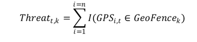
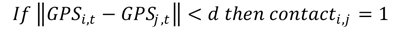
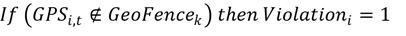

# Global Legal Hackathon

 

### Project Contacts

Matthew Schneider
    Assistant Professor of Statistics
    LeBow College of Business at Drexel University

Jordan L. Fischer, Esq.
    Teaching Professor of Law
    Thomas R. Kline School of Law at Drexel University
    [jlf324@drexel.edu](jlf324@drexel.edu)

Cameron Bale
    PhD Student in Business Analytics
    LeBow College of Business at Drexel University

### Location-Based Data Privacy Solution

This Project addresses the trade-off between the accuracy of location data with privacy and legal privacy protections.

Prior research (de Montjoye et al. 2013) shows that four spatio-temporal points are enough to uniquely identify 95% of individuals. This means that the assortment of COVID-19 location-tracking apps are destined to identify some individuals. Privacy concerns are further exacerbated when geospatial points can be traced to home addresses which are linked to public tax and real estate sale records.

### Project Goals

For the purpose of this FT Global Legal Hackathon, this project addresses the following core components: 

* Matching legally defined terms to use metrics of location data. 

* Statistical process to reduce the identifiability of individuals while maintaining most of the usefulness of the data

### Proposed Solution

#### Project Assumptions & Out of Scope Matters

Due to the shortened timeline of this project, our team made a number of assumptions and selected to only address a sub-set of the issues related to the trade-off between data location and privacy.

1. Varying Legally Defined Terms 

The key terms used in this project (see below) have a vareity of different defintions. These definitions are provided from a variety of stakeholders: legislatures crafting regulation, courts in their legal decisions, standards committees who provide varying frameworks, etc. Our project focuses instead on core privacy principles in the spirit of these defintions and created standard defintions from a vareity of sources for the purposes of this limited scope of analysis. However, we recognize that these terms are arguablly nuanced. As such, in future work, we will look to further explore these various defintions.

2. Technoloigical Solution

We focused on one technological solution for location apps that use GPS data. We explored the tradeoff between the accuracy of location data and privacy for COVID-19 persons in South Korea only. In the future, we will expand our solution to other countries that use GPS or Bluetooth data.

### Legal Framework with Related Statistical Analysis 

The use of location data as solution to address the spread of COVID-19 directly impacts interrelated but distinctly different terms under privacy law: 

* Pseudonymization;
* De-identification;
* Anonymization; and
* Aggregation.

These terms are similar and often used interchangeably. The terms generally address the core idea of removing identifiers from data. However, with regulations and standards, each term can be defined and used distinctinly differentlly. This creates regional challenges in creating uniform solutions (in the form of applications, etc.) since each law can restrict the way in which the technology is required to remove identifying information.

As such, our proposed solution presents four different use metrics and identifies the corresponding legal terms that could apply to those use metrics. For each of these terms, we identify the relevant privacy strength (low, medium, high).  

#### Pseudonymization

* Privacy Strength: <b>LOW</b>

The term pseudonymization is most relevant within the European Union under the General Data Protection Regulation ("GDPR"). [1] The GDPR defines pseudonymization as: 

> the processing of personal data in such a manner that the personal data can no longer be attributed to a specific data subject without the use of additional information, provided that such additional information is kept separately and is subject to technical and organisational measures to ensure that the personal data are not attributed to an identified or identifiable natural person [Art. 4(5)].

Two key factors are inherent in this definition: (1) attribution and (2) additional information. Based on this defintion, it appears that so long as the "additional information" that can be use to identify the information is removed and separated from the non-identifer information, the data converts from personal data to data that does not fall under the GDPR.

Based on this, our project generated the following generalized defintion for pseudonymization:

> the processing of personal information in a manner that renders the personal information no longer attributable to a specific consumer without the use of additional information.

#### De-Identification

* Privacy Strength: <b>MEDIUM</b>

The term de-identification is used within US-based cybersecurity and data privacy concepts. The National Institutes of Standards and Technology ("NIST") relies on this concept for removing identifiers from personal information, defining de-identification as:

> general term for any process of removing the association between a set of identifying data and the data subject [2].

By removing this association between the identifier and the information, information becomes de-identified, thereby reducing certian privacy concerns. Additional uses of the term "de-idenfitication" can be found in the Health Insurance Portability and Accountability Act (HIPAA) and the California Consumer Privacy Act of 2018. 

Based on these sources, our project generated the following generalized definition for "de-identification":

> Information that cannot reasonably identify, relate to, describe, be capable of being associated with, or be linked, directly or indirectly, to a particular individual.

#### Anonymization

* Privacy Strength: <b>MEDIUM</b>

The concept of annonymization is used across a variety of different legal frameworks and regions. For example, NIST defines this term as:

> the process that removes the association between the identifying dataset and the data subject [2]. 

Further, while the term annonymization is not defined within the GDPR, it is used by the European Data Protection Board ("EDPB") in further explaining the impact of the GDPR within the context of geolocation tracking. [3] The Guidelines state that

> Anonymisation refers to the use of a set of techniques in order to remove the ability to link the data with an identified or identifiable natural person against any “reasonable” effort. This “reasonability test” must take into account both objective aspects (time, technical means) and contextual elements that may vary case by case (rarity of a phenomenon including population density, nature and volume of data). If the data fails to pass this test, then it has not been anonymised and therefore remains in the scope of the GDPR. ¶ 15

Futher, these Guidelines outline three factors to determine the "robustness of anonymization": 

> (i) singling-out (isolating an individual in a larger group based on the data); (ii) linkability (linking together two records concerning the same individual); and (iii) inference (deducing, with significant probability, unknown information about an individual). ¶ 16

This defintion presents a challenge to truly remove the identifier unless differential privacy is employed. 

Based on this guidance, our project generated the following generalized defintion for "anonymization":

> A process that removes the association between the identifying dataset and the data subject.

#### Aggregation

* Privacy Strength: <b>HIGH</b>

The concept of aggregated data bridges both the annonymity of information and the amount of information collected. In essence, it the combination of volume plus annonymity that allows aggregated data to be less prone to privacy concerns. The CCPA directly recognizes the concept of aggregation as follows:

> information that relates to a group or category of consumers, from which individual consumer identities have been removed, that is not linked or reasonably linkable to any consumer or household, including via a device. “Aggregate consumer information” does not mean one or more individual consumer records that have been de­identified. [4]

Additionally, the GDPR does recognize the concept of statistical research in Recital 162, stating:

> Statistical purposes mean any operation of collection and the processing of personal data necessary for statistical surveys or for the production of statistical results. Those statistical results may further be used for different purposes, including a scientific research purpose. The statistical purpose implies that the result of processing for statistical purposes is not personal data, but aggregate data, and that this result or the personal data are not used in support of measures or decisions regarding any particular natural person.

Based on these resources, our project generated the following generalized definition of "aggregation":

> Information that relates to a group or category of individuals, from which individual identities have been removed, that is not linked or reasonably linkable to any individual.

### Statistical Metrics

Across the world, location-based apps for COVID-19 use a variety of metrics and dashboards for the analysis of Global Positioning System (GPS) and Bluetooth data. Metrics vary based on regional differences in privacy regulations (see [10] and [11]), however, the underlying usefulness of the location data can be described by four statistical metrics that we present here.   

For clarity, we present all metrics using GPS coordinates (latitute and longitude) which can be represented in terms of geospatial distances to each other.  Many apps also use Bluetooth data which limits some of the usefulness of the location data, but has an analagous representation.  For example, Metric 1 can be replicated by using Bluetooth receivers at specific locations which correspond to specific GPS coordinates. Additionally, Bluetooth also requires proximity of distance.

#### Metric 1 (Location Risk)
The number of COVID-19 persons at specific location k on day t

Legal Basis: Aggregation and De-Identification

For example: 

	> There were 3 (Threat) COVID-19 persons in Washington Square Park (k) on Tuesday (t).
    
	> There were 0 (Threat) COVID-19 persons in South Street Grocery (k) on Wednesday (t).
    
Goal: To provide information to the public for their past risk on all days (t) and all locations (k). 

Examples: 
*South Korea

Privacy Solution: 
*(Cameron)

#### Metric 2 (Neighborhood Risk)
The number of COVID-19 persons visiting neighborhood k on day t

Legal Basis: Aggregation

For example: 

	> 1% (Prevalence) of the residents in Graduate Hospital (k) on Tuesday (t) had COVID-19.
    
	> 0.5% (Prevalence) of the residents in Philadelphia (k) on Wednesday (t) had COVID-19.

Goal: Public health indicators for all days (t) and all neighborhoods (k). 

Examples: 
*South Korea

Privacy Solution: 
* (Cameron)
* Theoretical-based Privacy Protection: Differential privacy-based histogram with noise infusion based on [8].  For example, you would add a random number to the the number of COVID-19 cases in the numerator of Metric 2 before releasing the statistic to the public. This solution is important because it is effective on neighborhoods with no COVID-19 cases.  Differential privacy ensures that additional insights about any person is not greatly altered whether they are in the data set or not.

#### Metric 3 (Contact Tracing)
Did person i have contact with person j at any time y within distance d ?

Legal Basis: NIST Anonymization and GDPR Pseudonymisation

For example: 

	> Bob (i) was within 6 feet (d) of Jane (j) at 11:15:20 AM on May 2, 2020 (t).
	> Bob (i) was within 6 feet (d) of John (j) at 11:25:45 AM on May 7, 2020 (t).
	> Jane (i) was within 6 feet (d) of Matt (j) at 1:47:23 AM on May 9, 2020 (t).
	> A social network is established: Bob is now connected to both Jane and John in the 1st degree. Bob is connected with Matt in the 2nd degree. 
	> Bob (i) was diagnosed with COVID-19.  Jane and John are notified.   

Goal: To contact all persons for testing that are 1st degree (or 2nd degree) with a COVID-19 person.

Examples: 
* South Korea 
* Israel 
* Singapore
* Many others using either Bluetooth or GPS (see [10] and [11])

Privacy Solution: 
* Fundamental privacy issues: [6] and [9] discuss fundamental privacy issues with using network data with additional identifiers and/or information. Network data is not very private.
* Privacy-preserving network:  Release a privacy-preserving graph degree sequence based on the scientific methodology of [7]. For example, the graph degree of Bob in the above example is 2 because Bob connects to Jane and John.  This number would have to be altered to protect the privacy of the entire network. 

#### Metric 4 (Quarantine Commpliance)
Did person i leave location k at any time t?

Legal Basis: Psuedonymization

For example: 

	> Bob (i) left his apartment at 11:15:20 AM on May 2, 2020 (t) and has violated his quarantine.

Goal: To quarantine a person within a specific location

Examples: 
* Hong Kong for COVID-19 persons and newly arrived visitors 
* Poland for 14 days

Privacy Solution: 
* Psuedonymization - Removing all direct and indirect identifiers
* Control - Access control with governmental authority and increased data security measures

### Repository for Tools and Documents for Hackathon Project

### Future Work

Through this initial project, our team identified the following areas for future work to continue to build out effective solutions to balance the accuracy of location-data and privacy concerns:

1. Identifying the Privacy Risks 

2. Further define key legal terms & factors with corresponding statistical analysis

3. Differentially private histogram approach for geospatial data which provides a theoretical guarantee to individual privacy

### Contact Us

If you are interested in this work, or want to work with us, please reach out:

### Appendices 

[1] Regulation (EU) 2016/679 of the European Parliament and of the Council of 27 April 2016 on the protection of natural persons with regard to the processing of personal data and on the free movement of such data, and repealing Directive 95/46/EC.

[2] NIST Special Publication 800-53 (Rev. 4).

[3] European Data Protection Board Guidelines 04/2020 onthe use of location data and contact tracing tools in the context of the COVID-19 outbreak, 2020.04.21.

[4] The California Consumer Privacy Act of 2018, Cal. Civ. Code § 1798.100, <em>et seq.</em>

[5] Harvey, S. J. (2013). Smart Meters, Smarter Regulation: Balancing Privacy and Innovation in the Electric Grid. UCLA L. Rev., 61, 2068.

[6] Fienberg, S. E. (2013). Is the Privacy of Network Data an Oxymoron?. Journal of Privacy and Confidentiality, 4(2).

[7] Karwa, V., & Slavković, A. B. (2012, September). Differentially private graphical degree sequences and synthetic graphs. In International Conference on Privacy in Statistical Databases (pp. 273-285). Springer, Berlin, Heidelberg.

[8] Li, B., Karwa, V., Slavković, A., & Steorts, R. C. (2018). A Privacy Preserving Algorithm to Release Sparse High-dimensional Histograms. Journal of Privacy and Confidentiality, 8(1).

[9] Stutzman, F. D., Gross, R., & Acquisti, A. (2013). Silent listeners: The evolution of privacy and disclosure on Facebook. Journal of privacy and confidentiality, 4(2), 2.

[10] Norton Rose Fulbright (2020). Contact tracing apps: A new world for data privacy. Accessed on May 17, 2020 from https://www.nortonrosefulbright.com/en/knowledge/publications/d7a9a296/contact-tracing-apps-a-new-world-for-data-privacy

[11] Tsang, Samantha (2020). Here are the contact tracing apps being deployed around the world. Accessed on May 20, 2020 from https://iapp.org/news/a/here-are-the-contact-tracing-apps-being-employed-around-the-world/
